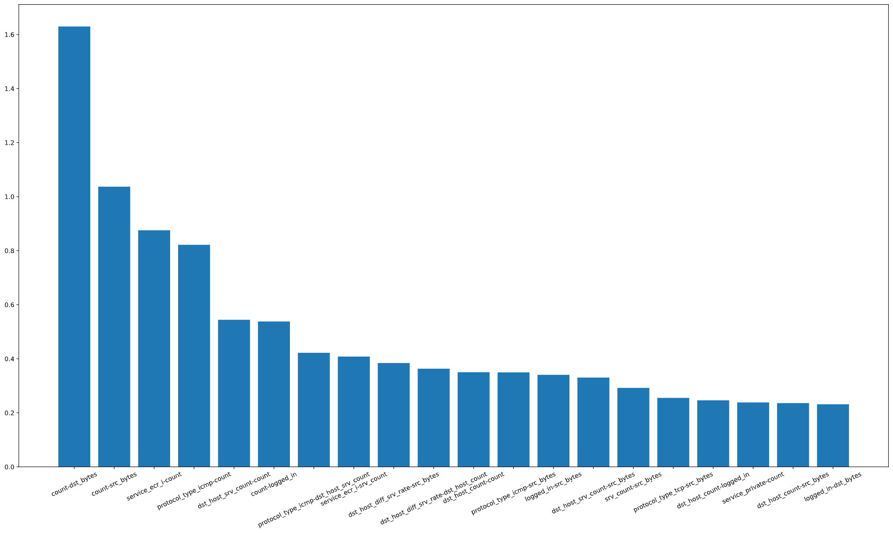

# NVIDIA dli workshop from the GTC 2021:
DLI workshop GTC 2021: Applications of AI for Anomaly Detection  

## Why is the kdd99 dataset so/too easy?

1. some simple rules find > 99% of majority classes
2. UMAP finds good 2-D represenation
3. shap in XGBOOST likes a few features/feature combinations 

## simple rules to classify attacks:

|attack|description|rule "accuracy"|
|----------|--------------------------------|---|
|- |- |- |
|smurf: |icmp echo to broadcast based DoS|             rule finds: 99.9188%|
|neptune: |SYN flood DoS| rule finds: 99.84% but also others: 987 portsweep 594 satan|
|teardrop: |fragmented packets with "wrong" offsets| rule finds: 99.08% |
| | | | 

see the notebook for details

## part two: SHAP(ley) values and plots

get the same important features way easier with the SHAP package to calculate shapley values and plot nice graphs

- sum of absolute shap values

e.g.
- high count value (511) leads to high SHAP value == high prediction for class 1 == anomaly
- high src_bytes likely anomaly
- high dst_bytes likely normal
- high ecr_i == 1 (echor) icmp attack
- icmp==1 likely smurf attack

- the path of the misclassified anomalies are highly influenced by the features [count,dst_bytes,src_bytes] at the top which brings the decision to the left i.e. negative side

- influential feature combinations like (count,dst_bytes) (icmp, count)

- plot on test data
- service_private == 1, i.e. high ports > 45000, means likely attack
- coloring to combine second feature, here for example src_bytes only have high values if private==0 and have 'normalizing' effect meaning no attack

