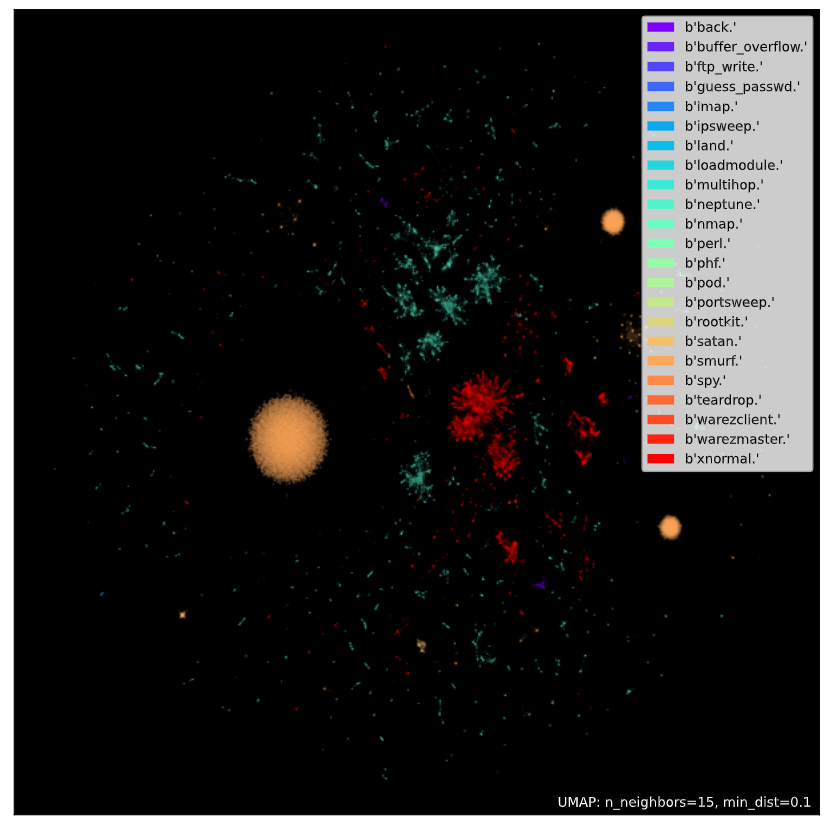

# dli_workshop_GTC_2021
DLI workshop GTC 2021: Applications of AI for Anomaly Detection  -- RECAP:
Why is the kdd99 dataset so easy?

1. some simple rules find > 99% of majority classes
2. UMAP finds good 2-D represenation
3. shap in XGBOOST likes a few features/feature combinations 

## simple rules to classify attacks:

|attack|description|rule "accuracy"|
|----------|--------------------------------|---|
|- |- |- |
|smurf: |icmp echo to broadcast based DoS|             rule finds: 99.9188%|
|neptune: |SYN flood DoS| rule finds: 99.84% but also others: 987 portsweep 594 satan|
|teardrop: |fragmented packets with "wrong" offsets| rule finds: 99.08% |
| | | | 

see the notebook for details

